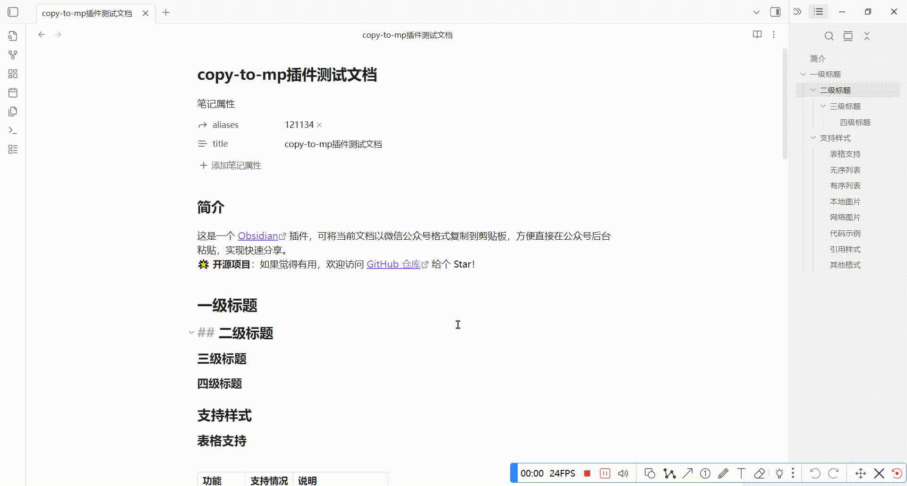

# 一键复制文档到微信公众号

这是一个 [Obsidian](https://obsidian.md) 插件，可将当前文档以微信公众号格式复制到剪贴板，方便直接在公众号后台粘贴，实现快速分享。

插件支持 **Markdown 正文、本地图片与网络图片** 的完整复制，无需依赖第三方网站，也不需要配置公众号密钥、 Token 等任何信息。只需执行一次obsidian命令，复制后粘贴即可完成发布流程。

## 使用演示



## 功能特性

- 支持通过 **命令面板（Ctrl + P）** 运行，也可绑定快捷键
    
- 支持：复制**选中内容**,未选中内容时，复制**整个文档**
        
- 自动将内容转换为**微信公众号可直接粘贴的 HTML 格式**
    
- 媒体支持：支持本地图片和网络图片

- 样式处理：目前只有内置样式，后续会扩展支持多套样式方案

-  配置功能：粘贴内容可包含Markdown 文件名，文档开头的元数据

## 已知问题

- 暂不支持移动端 Obsidian
    
- 当图片较多或图片较大时，Data URI 方式可能占用较多内存
    
- 列表中部分加粗内容在个别场景下可能出现自动换行

- 不支持视频复制

## 安装

目前只支持本地安装（提交obsidian官方还未审核通过，无法在线安装）。

安装方法可参考我的教程：
[Obsidian 进阶教程：插件安装](https://blog.520233.best/Obsidian-%E8%BF%9B%E9%98%B6%E6%95%99%E7%A8%8B%EF%BC%9A%E6%8F%92%E4%BB%B6%E5%AE%89%E8%A3%85)

发现问题可在 Issue 中反馈。


## 开发

参考：[Obsidian 示例插件](https://github.com/obsidianmd/obsidian-sample-plugin)
官方文档：[Build a plugin](https://docs.obsidian.md/Plugins/Getting+started/Build+a+plugin)

* 推荐 Node.js 版本：v20.11.1

### 项目目录结构

```
obsidian-copy-as-html/
├── .github/                    # GitHub 相关文件
│   └── workflows/              # CI/CD 工作流
├── node_modules/               # 依赖包
├── .editorconfig               # 编辑器配置
├── .eslintignore               # ESLint 忽略配置
├── .eslintrc                   # ESLint 配置
├── .gitignore                  # Git 忽略文件
├── .npmrc                      # npm 配置
├── esbuild.config.mjs          # 构建配置
├── LICENSE                     # 许可证
├── main.js                     # 编译后的主插件文件
├── main.ts                     # 主 TypeScript 源代码
├── manifest.json               # Obsidian 插件清单
├── package.json                # npm 包配置
├── package-lock.json           # npm 依赖锁定
├── pnpm-lock.yaml              # pnpm 依赖锁定
├── README_zh.md                # 中文版 README
├── styles.css                  # 插件样式
├── tsconfig.json               # TypeScript 配置
├── version-bump.mjs            # 版本更新脚本
└── versions.json               # 版本历史
```

## 联系方式

你的支持是项目持续更新的动力


WX联系方式，请道明来意


## 致谢

本项目参考并基于以下优秀开源项目，特此感谢：

* [花生编辑器](https://github.com/alchaincyf/huasheng_editor)
* [copy-as-html 插件](https://github.com/mvdkwast/obsidian-copy-as-html)

